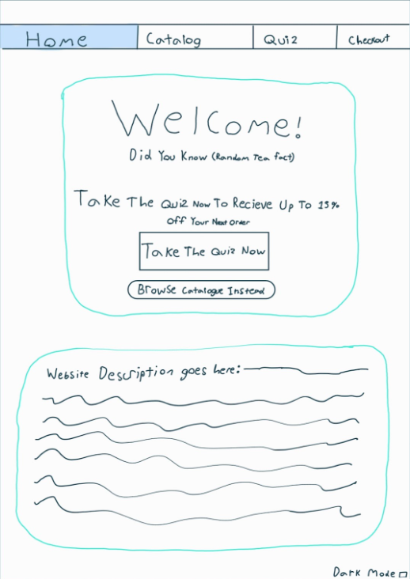
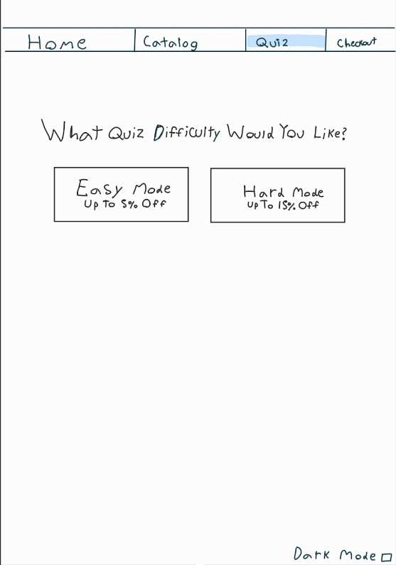
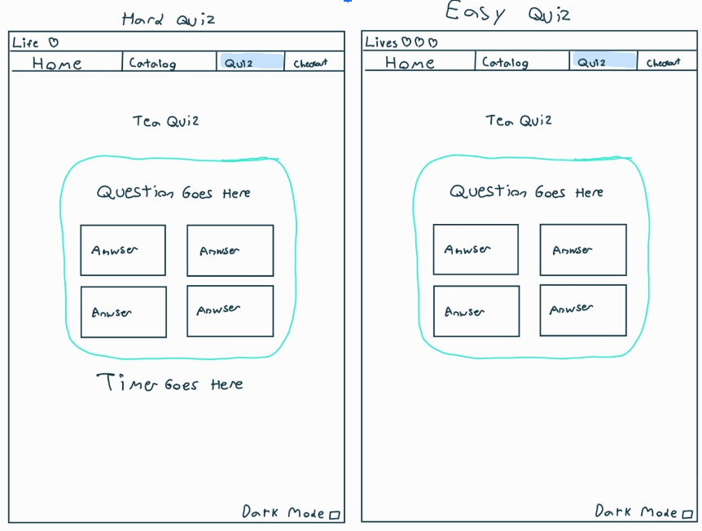
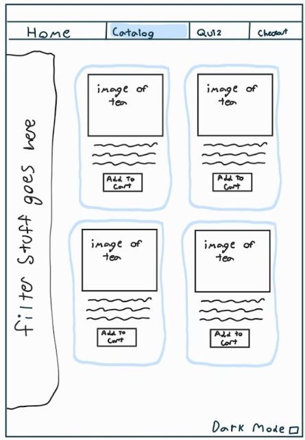
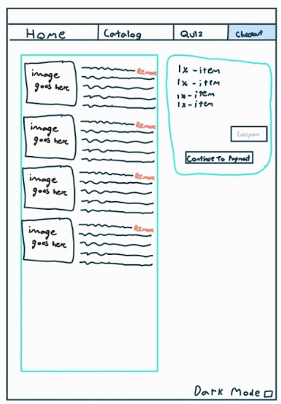
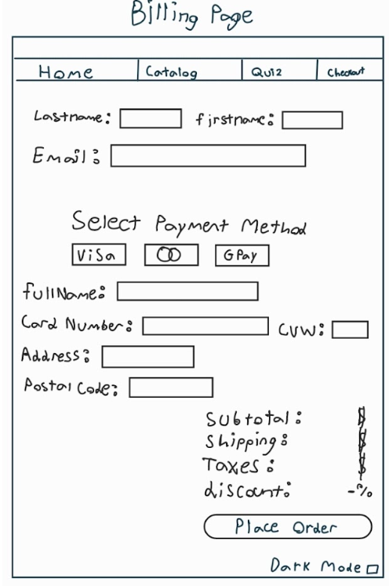

# This is project for internet called TeaMMMMMViewer

<b>What Project Is About:</b> 

  This project is a tea browsing website, where you can order teas and other small equipment. One of the main features of this website is a quiz, which tests the users knowledge in order to win discounts on tea. There will also be an informative section that talks about different teas and their unique properties. 

<b>Home Page:</b> 

  The home page will start off by welcoming the user and directing his attention to the core components of the website. There will be a tea catalog browser and a button that will redirect the user to the home page. The home page will provide basic information about the goal of our website and some randomly generated tea facts. There might even be a button that will change the website into “dark mode”

<b>Quiz Pages:</b> 

  Upon entering the quiz page, the user will be presented with 2 choices of quiz. An easy quiz composed of 5 random questions. The user will have 3 lives to complete this quiz, or else they lose. If they manage to succeed, they will receive a 5% discount. The user will also have a choice to do a hard quiz, that will be composed of advanced questions about tea. They will only have 1 life, and if they manage to complete it, they will be rewarded with a 15% discount. The website might also display a 10 second timer so the user wouldn’t be able to google the questions

<b>Tea Catalog:</b> 

	The tea catalog will be composed of a great selection of teas and there will be filters (checkboxes and a search bar) in order to get more precise answers. You will be able to see a small description of each tea and a button that will add this tea to your cart. You will then be able to press on the checkout box on the bottom right of the screen.

 

<b>Checkout Page:</b> 

  The checkout will show all of the items that the user has selected and the subtotal. It will also be where the user can apply his discount and proceed to the billing page, where he could see the total and put his shipping details as well as their payment details.

<b>WireFrames:</b> 

